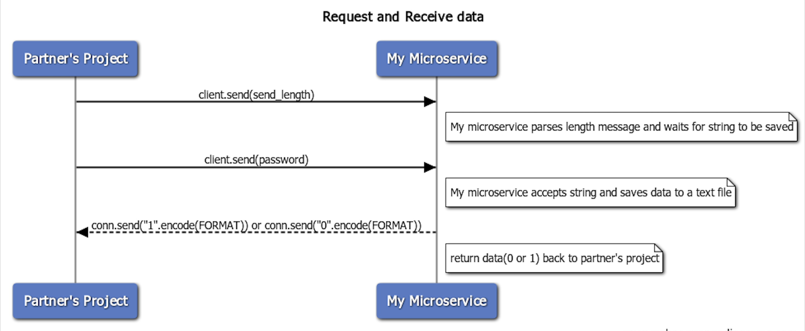

<!DOCTYPE html>
<html>
<head>
    

  
</head>

<body>
<h1>************COMMUNICATION CONTRACT********</h1>
<h2>A. How does the microservice I implemented programmatically request data?</h2>

The micro-service I designed uses sockets to request data. The microservice is running while the partner's project is running, then when the project has data that needs to be processed (in this case a string that it wants to save to a text file), the project will send the string data to the port using the send function seen below

    def send(msg):
        # Encode the msg to UFT-8 format and store it in a variable message
        message = msg.encode(FORMAT)
        # Get the length of the message
        msg_length = len(message)
        # encode the length 
        send_length = str(msg_length).encode(FORMAT)
        #send_length += b' '*(HEADER - len(send_length))
        print("Sending the message from project to microservice........")
        client.send(send_length)
        print(f"sending the message 1: {send_length}")
        client.send(message)
        print(f"sending the message 2: {message}")
        
The protocol which is agreed upon between the sender and the receiver is that the first message will be a message of 64 bytes indicating the length of the second message. The second message will contain the actual contents that the project wishes to be saved to a text file. This method is needed because in order to accept a message using the sockets method, it is required to know the size of the message which is expected. Therefore the first message will be of an agreed-upon size (64 bytes) and will contain information about the size of the upcoming message.  

<h2>B. How does the microservice I implemented programmatically receive data?</h2>
<>The microservice will use the agreed-upon format of first accepting a message of 64 bytes as the first message, then parsing that message to find the length of the message which is about to be sent by the project to the microservice. That length of data will tell my microservice how many bytes it should be expecting. After the msg_length message is sent, I can then use that information to recvice the actual message (seen in the second receive call below).

      msg_length = conn.recv(HEADER).decode(FORMAT)
      if msg_length:
          msg_length = int(msg_length)
          # recevie the real password which is message 2
          msg = conn.recv(msg_length).decode(FORMAT)
<h2>C. UML sequence diagram showing how requesting and receiving data works. Make it detailed enough that your partner (and your grader) will understand.</h2>             

 <h5> My Partner's Project: Random Password Generator  *****  ******* My microservice: SaveTOFile</h5>
 
</body>
</html>

